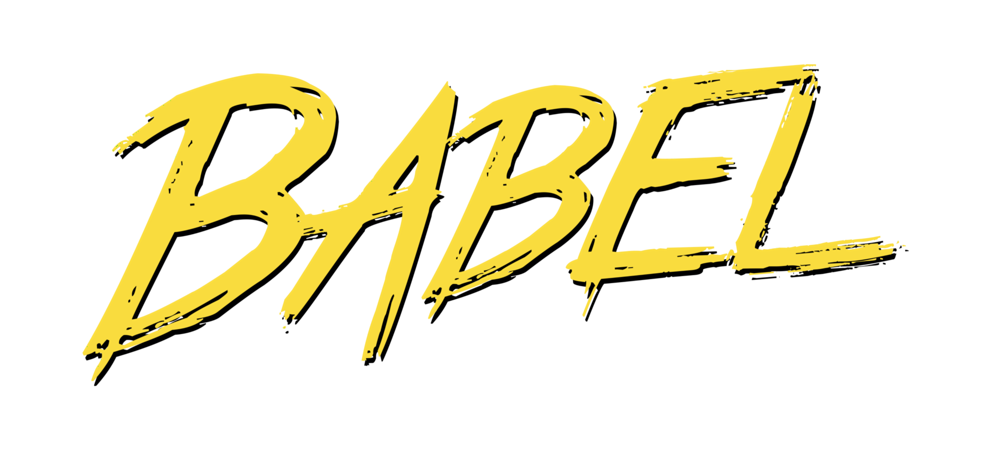
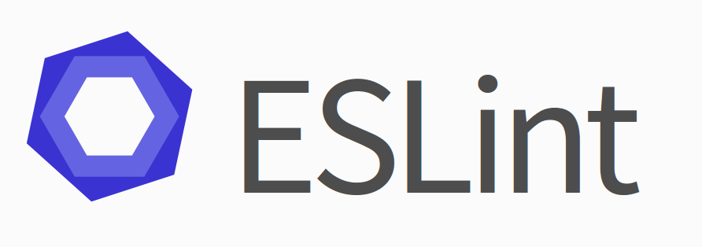

# mariasyed react app

To run this application, execute the following commands:

  1. Install NPM modules

    $ npm install (or yarn install)

  2. Start the front-end dev server:

    $ npm run dev (or yarn dev)

  3. To create the app for distribution

    $ npm run build (or yarn build)

## Tools / Tech used

